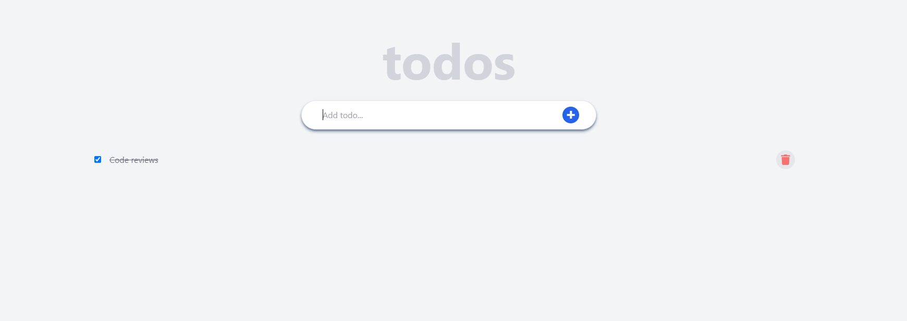

# the-gym-react-exercises

This is a [React.js](https://reactjs.org/) project bootstrapped with [`create-react-app`]().

# the-gym-todo-app-react

## Welcome! 👋

This is a solution to the Gym Traning. The Gym challenge help us to improve our coding skills by building realistic projects.Once you have completed the course above, go through these exercises
For each of these projects, create a GitHub repo for them and use react(in the create react app form).
In this exercise, we will use reactjs, tailwind.
These exercises will help you apply the basic concepts of React through tiny projects. Once you finish all exercises, you'll know you've got the basics down. Then you can start learning more advanced concepts, and build more complicated projects

## Content

- [the-gym-calculator-react](#the-gym-calculator-react)
- [Welcome! 👋](#welcome)
- [The Exercise](#the-challenge)
- [Screenshot](#screenshot)
- [Links](#links)
- [My process](#my-process)
- [Author](#author)
- [Connect Us](#connect-us)

### The challenge

Build a react to-do app that performs basic tasks such as adding a to-do, marking it as completed, and deleting it.

To make the design, you can use tailwindcss and fontawesome for the icons.

A checkbox on the to-do list marks the task as completed. Keep in mind that a completed task should be displayed with the name struck through

### Screenshot

### Links

- Live Site URL Open [Challenge](https://scintillating-gelato-2554b1.netlify.app/) with your browser to see the result.

## My process

- React
- Tailwind css

## Author

- Twitter - [@ibrahim_Bagalwa](https://twitter.com/ibrahim_Bagalwa)
- LinkedIn - [ibrahim-bagalwa](https://www.linkedin.com/in/IbrahimBagalwa)

## Connect Us:

   

---

